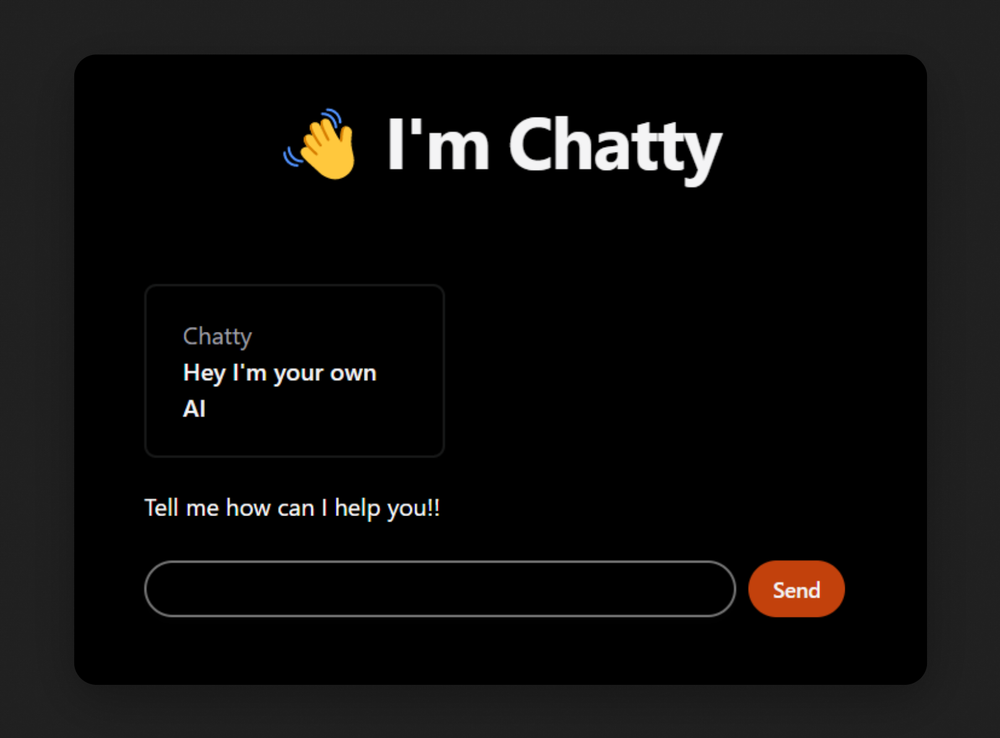

# Chatty AI

Chatty is a faster clone of ChatGPT. Is Open-Source, so use the code for your own projects!!
If have questions or need help, feel free to reach me on [@SanxRoz](https://twitter.com/SanxRoz)

## Made with

- Next.js
- OpenAI API (REST endpoint)

## Deploy it

Use Vercel [Vercel](https://vercel.com) to deploy and test Chatty:

## Credits

Thanks to [Vercel](https://vercel.com/templates) for the inspiration. I highly recommend checking their templates.

This project is meant to show people that you can build your own AI products in days.

Keep learning, testing and coding!!

### Learn by doing!